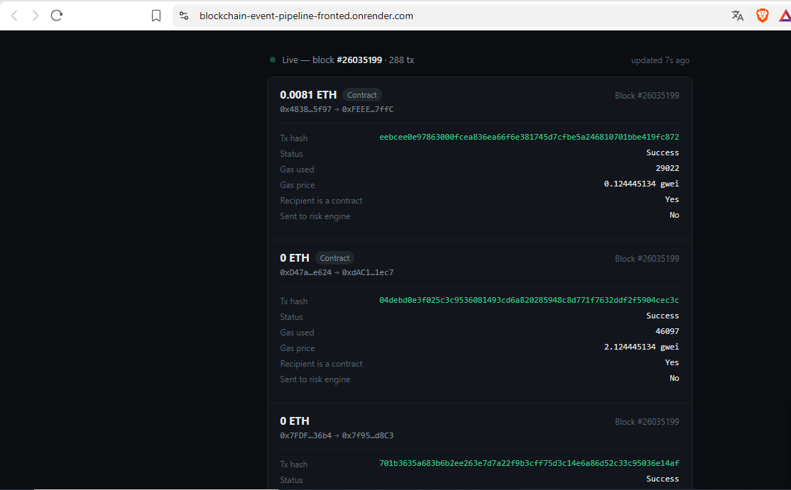

# Blockchain Event Pipeline

A real-time Ethereum block listener that polls the network for new blocks, normalizes every transaction, stores them, and automatically forwards high-value transactions to a downstream risk engine.



**Live demo:** _pending deployment_
**Video walkthrough:** _pending_

## Problem

Raw blockchain data is not directly usable — you need something continuously watching new blocks, extracting the transactions inside them, and turning that raw data into structured records you can query, filter, and act on. Without this, every "what happened on-chain recently" question means manually re-scanning blocks from scratch.

## Solution

A background listener task, running alongside a FastAPI service, that:

1. Polls for new blocks on a fixed interval
2. Fetches full transaction data for each new block via RPC
3. Normalizes every transaction into a flat record (value, gas, contract interaction flags, status)
4. Persists it to a local database
5. Forwards any transaction above a configurable ETH threshold to the [Risk Monitoring Engine](https://github.com/OnChainForge/risk-monitoring-engine) for rule evaluation
6. Exposes everything it has seen via a simple REST API and a live-updating frontend feed

## Architecture

Ethereum mainnet (Infura RPC)
│
▼
background listener (polls every N seconds)
│
├──▶ normalize transactions
│
├──▶ SQLite (blocks, transactions)
│
└──▶ high-value tx? ──POST──▶ Risk Monitoring Engine (/events/)
│
▼
FastAPI REST API (/blocks/, /transactions/)
│
▼
Frontend live feed (polls every 8s)


- **Backend**: FastAPI, SQLAlchemy, Pydantic, web3.py, httpx
- **Database**: SQLite (WAL mode)
- **Frontend**: Vanilla HTML/CSS/JS

## Stack

Python · FastAPI · SQLAlchemy · web3.py · httpx · SQLite · Vanilla JS

## Running locally

```bash
python3 -m venv venv
source venv/bin/activate
pip install -r requirements.txt
cp .env.example .env  # fill in ETHEREUM_RPC_URL
uvicorn app.main:app --reload --port 8001
```

Frontend:
```bash
cd frontend
python3 -m http.server 5501
```

Open `http://localhost:5501`.

**Note:** the [Risk Monitoring Engine](https://github.com/OnChainForge/risk-monitoring-engine) should also be running (on port 8000) for the forwarding step to succeed — without it, the listener still stores every transaction locally, it just logs a connection error on the forwarding attempt.

## API

| Method | Endpoint | Description |
|---|---|---|
| `GET` | `/health` | Service health check |
| `GET` | `/blocks/` | Last 20 processed blocks |
| `GET` | `/transactions/` | Last 50 normalized transactions |

## Technical decisions

- **Worker-thread block processing**: block processing performs blocking RPC calls, which would freeze the FastAPI event loop if run directly inside the async listener. Each block is processed via `asyncio.to_thread`, keeping the API responsive even while a large block (300+ transactions) is being processed.
- **Per-transaction commits + WAL mode**: early versions committed once per block, holding a write lock for the entire block's processing time and blocking API reads. Switched to committing after each transaction and enabling SQLite's WAL journal mode, so reads and writes can happen concurrently.
- **Independent service, connected over HTTP**: this pipeline doesn't import or depend on the Risk Monitoring Engine's code — it calls it over HTTP, the same way any external consumer would. This keeps both services independently deployable and testable.

## Challenges & learnings

- Initial implementation froze on any read request (`GET /blocks/`) while a block was being processed. Root cause was two-fold: blocking RPC calls inside the async loop, and long-held SQLite write locks. Fixed with worker threads for RPC calls and WAL mode + granular commits for the database.
- Learned to always verify a code change was actually saved and loaded (via `cat` on the file, or checking server reload logs) before assuming a fix didn't work — several debugging sessions were caused by edits that silently failed to persist.

## License

MIT
